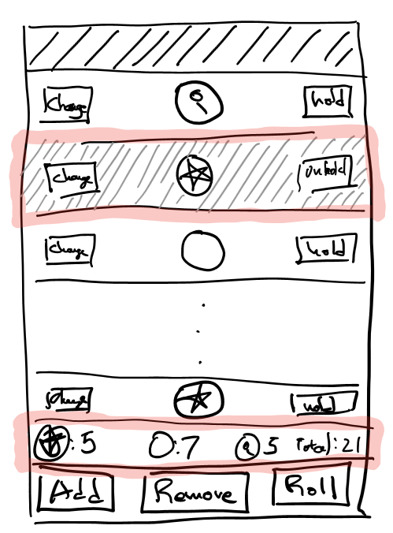
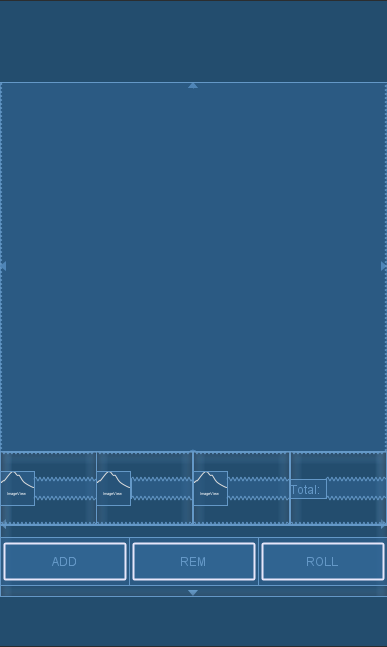

Android App - Mansions of Madness Dice - Part2
=======================================
In part 2 of this tutorial we put on our user experience hats on and address usability issues.

New Requirements
=============
In part one, we put together an app that covered the basic Mansions of Madness dice roll function. However, the app isn't very user friendly:

* For each roll, a user needs to scroll through the entire list and count dice. Manually counting dice is pretty cumbersome.
* A User can't tell if a dice is set to 'hold'. Without any visual cue, it's really easy to lose track of which dice is held and unheld.
* When a player triggers a roll, the dice face just changes or remains the same. This can be especially confusing if say there was only 1 dice and the player rolls the same value as before.

To tackle the above issues:
* Expand the bottom area with a dice count widget.
* Tapping 'hold' changes the row background color and button text.
* Tapping 'roll' triggers an animation. The animation will be a dice spin. Each dice will spin between 1 and 3 seconds and between 1 and 3 revolutions.

Design
=======


Implementation Steps
======================

1.  Refactor Inner classes into outer classes for better organization.
2.  Add Dice summary.
3.  Populate Dice count into summary
4.  Set row background grey when Dice is in 'HELD' state.
5.  Spin dice on roll with animation

Step 1 : Refactor
==================
Currently, all the app logic sits in one class ````MainActivity.java````. As we add more features, the Code will get pretty messy and difficult to read with everything  in one place. As a first step, we split out the inner classes into top level classes ````Dice```` and ````DiceAdapter````.

    Dice.java

    public class Dice {
        public enum Face {
            BLANK,
            MAGNIFY,
            STAR
        }

        public static Random random = new Random();

        boolean hold = false;
        Face diceVal;

        Dice() {
            roll();
        }

        public void roll() {
            int num = random.nextInt(4);
            if(num == 0) { //25% magify
                this.diceVal = Face.MAGNIFY;
            } else {
                //37.5% star, 37.5% blank
                if(random.nextBoolean()) {
                    this.diceVal = Face.BLANK;
                } else {
                    this.diceVal = Face.STAR;
                }
            }
        }

        public void toggleHold() {
            hold = !hold;
        }

        public void nextValue() {
            int index = diceVal.ordinal();
            index = (index+1) % Face.values().length;
            diceVal = Face.values()[index];
        }
    }

    DiceAdapter.java

    public class DiceAdapter extends ArrayAdapter<Dice> {

        public DiceAdapter(@NonNull Context context, int resource, List<Dice> list) {
            super(context, resource, list);            
        }

        @Override
        public View getView(final int position, View convertView, ViewGroup parent) {
            if (convertView == null) {
                convertView = LayoutInflater.from(getContext()).inflate(R.layout.dice_row, parent, false);
            }

            //setup dice image
            ImageView imageView = convertView.findViewById(R.id.dice_icon);
            Dice dice = this.getItem(position);
            switch (dice.diceVal) {
                case BLANK:
                    imageView.setImageResource(R.drawable.blank_dice);
                    break;
                case MAGNIFY:
                    imageView.setImageResource(R.drawable.magnifying_glass);
                    break;
                case STAR:
                    imageView.setImageResource(R.drawable.star);
                    break;
            }

            //setup dice hold button
            Button holdButton = convertView.findViewById(R.id.dice_hold_button);
            holdButton.setOnClickListener(new View.OnClickListener() {
                @Override
                public void onClick(View v) {
                    Dice dice = getItem(position);
                    dice.toggleHold();
                    notifyDataSetChanged();
                }
            });

            //setup dice change button
            Button changeButton = convertView.findViewById(R.id.dice_change_button);
            changeButton.setOnClickListener(new View.OnClickListener() {
                @Override
                public void onClick(View v) {
                    Dice dice = getItem(position);
                    dice.nextValue();
                    notifyDataSetChanged();
                }
            });

            return convertView;
        }
    }

Step 2 : Dice Summary Layout
=======================
The Summary Widget is a 4 column layout position between the dice area and control area. Each column included blank dice count/label, star count/label, magnifying glass count/label, and total count.



    activity_main.xml

    <?xml version="1.0" encoding="utf-8"?>
    <android.support.constraint.ConstraintLayout
        xmlns:android="http://schemas.android.com/apk/res/android"
        xmlns:app="http://schemas.android.com/apk/res-auto"
        xmlns:tools="http://schemas.android.com/tools"
        android:layout_width="match_parent"
        android:layout_height="match_parent"
        tools:context=".MainActivity">

        <ListView
            android:id="@+id/dice_list"
            android:layout_height="0dp"
            android:layout_width="match_parent"
            app:layout_constraintBottom_toTopOf="@id/dice_summary"
            app:layout_constraintLeft_toLeftOf="parent"
            app:layout_constraintRight_toRightOf="parent"
            app:layout_constraintTop_toTopOf="parent">
        </ListView>

        <LinearLayout
            android:id="@+id/dice_summary"
            android:layout_width="match_parent"
            android:layout_height="@dimen/control_bar_line_height"
            android:orientation="horizontal"
            android:weightSum="4"
            app:layout_constraintBottom_toTopOf="@id/button_bar"
            app:layout_constraintLeft_toLeftOf="parent"
            app:layout_constraintRight_toRightOf="parent"
            app:layout_constraintTop_toBottomOf="@id/dice_list">
            <LinearLayout
                android:layout_height="match_parent"
                android:layout_width="0dp"
                android:layout_weight="1"
                android:orientation="horizontal">
                <ImageView
                    android:layout_width="wrap_content"
                    android:layout_height="wrap_content"
                    android:padding="@dimen/dice_padding"
                    android:layout_gravity = "center"
                    android:src="@drawable/star"/>
                <TextView
                    android:id="@+id/star_count"
                    android:layout_gravity="center"
                    android:layout_height="wrap_content"
                    android:layout_width="wrap_content"
                    android:text="count"/>
            </LinearLayout>

            <LinearLayout
                android:layout_height="match_parent"
                android:layout_width="0dp"
                android:layout_weight="1"
                android:orientation="horizontal">
                <ImageView
                    android:layout_width="wrap_content"
                    android:layout_height="wrap_content"
                    android:layout_gravity="center"
                    android:padding="@dimen/dice_padding"
                    android:src="@drawable/magnifying_glass"/>
                <TextView
                    android:id="@+id/mag_count"
                    android:layout_gravity="center"
                    android:layout_height="wrap_content"
                    android:layout_width="wrap_content"
                    android:text="count"/>
            </LinearLayout>

            <LinearLayout
                android:layout_height="match_parent"
                android:layout_width="0dp"
                android:layout_weight="1"
                android:orientation="horizontal">
                <ImageView
                    android:layout_width="wrap_content"
                    android:layout_height="wrap_content"
                    android:layout_gravity = "center"
                    android:padding="@dimen/dice_padding"
                    android:src="@drawable/blank_dice"/>
                <TextView
                    android:id="@+id/blank_count"
                    android:layout_gravity="center"
                    android:layout_height="wrap_content"
                    android:layout_width="wrap_content"
                    android:text="count"/>
            </LinearLayout>

            <LinearLayout
                android:layout_width="0dp"
                android:layout_weight="1"
                android:layout_height="match_parent"
                android:orientation="horizontal">
                <TextView
                    android:layout_width="wrap_content"
                    android:layout_height="wrap_content"
                    android:layout_gravity="center"
                    android:text="@string/total_label"/>
                <TextView
                    android:id="@+id/total_count"
                    android:layout_gravity="center"
                    android:layout_height="wrap_content"
                    android:layout_width="wrap_content"
                    android:text="count"/>
            </LinearLayout>
        </LinearLayout>

        <LinearLayout
            android:id="@+id/button_bar"
            android:layout_weight="1"
            android:layout_width="match_parent"
            android:layout_height="@dimen/control_bar_line_height"
            android:orientation="horizontal"
            android:weightSum="3"
            app:layout_constraintBottom_toBottomOf="parent"
            app:layout_constraintLeft_toLeftOf="parent"
            app:layout_constraintRight_toRightOf="parent"
            app:layout_constraintTop_toBottomOf="@id/dice_summary">
            <Button
                android:id="@+id/add_dice_button"
                android:layout_gravity = "center"
                android:layout_weight="1"
                android:layout_width="wrap_content"
                android:layout_height="wrap_content"
                android:text="@string/add_button_label"
                android:onClick="addDice"/>
            <Button
                android:id="@+id/rem_dice_button"
                android:layout_gravity = "center"
                android:layout_weight="1"
                android:layout_width="wrap_content"
                android:layout_height="wrap_content"
                android:text="@string/rem_button_label"
                android:onClick="removeDice"/>
            <Button
                android:id="@+id/roll_dice_button"
                android:layout_weight="1"
                android:layout_gravity = "center"
                android:layout_width="wrap_content"
                android:layout_height="wrap_content"
                android:text="@string/roll_button_label"
                android:onClick="rollDice"/>
        </LinearLayout>

    </android.support.constraint.ConstraintLayout>

Step 3: Populate Dice Count into Widget
==============================================

Next, we populate the widget with dice counts. We add 2 methods to ````MainActivity.java````.  ````updateDiceCount```` populates the values into the TextView and ````countDice```` counts the dice. Every time we change dice values such as ````MainActivity.rollDice```` and ````changeButton.onClick```` we update the dice count.

    MainActivity.java

    ....

    public void updateDiceCount() {
        TextView totalCount = findViewById(R.id.total_count);
        totalCount.setText(Integer.toString(diceList.size()));

        TextView blankCount = findViewById(R.id.blank_count);
        blankCount.setText(Integer.toString(countDice(BLANK)));

        TextView magCount = findViewById(R.id.mag_count);
        magCount.setText(Integer.toString(countDice(MAGNIFY)));

        TextView starCount = findViewById(R.id.star_count);
        starCount.setText(Integer.toString(countDice(STAR)));

    }

    private int countDice(Dice.Face type) {
        int count =0;
        for(Dice dice : diceList) {
           if(dice.diceVal == type) {
               count++;
           }
        }
        return count;
    }
    ....

Now that the ````DiceAdapter```` is in an outer class, we need a reference to the activity object from the adapter.

    public class DiceAdapter extends ArrayAdapter<Dice> {
        MainActivity activity;

        public DiceAdapter(@NonNull Context context, int resource, List<Dice> list) {
            super(context, resource, list);
            activity = (MainActivity) context;
        }
    ....
    //setup dice change button
       Button changeButton = convertView.findViewById(R.id.dice_change_button);
       changeButton.setOnClickListener(new View.OnClickListener() {
           @Override
           public void onClick(View v) {
               Dice dice = getItem(position);
               dice.nextValue();
               notifyDataSetChanged();
               activity.updateDiceCount();
           }
       });
    ....


Step 4: Hold Button Triggers Background Change
==============================================

Currently, the hold button triggers a state change in the dice object. For this feature we modify the adapter render logic to set row background color depending on the dice hold state. If the ````Dice.hold```` is true, then background color should be light grey, otherwise we set it white. We also set the text to "HOLD" or "UNHOLD"

        DiceAdapter.java

        ....
        @Override
        public View getView(final int position, View convertView, ViewGroup parent) {

           ....
           //change background button text depending on hold state
           if(dice.hold) {
               convertView.setBackgroundColor(Color.LTGRAY);
               holdButton.setText(getContext().getResources().getString(R.string.hold_button_unhold_label));
           } else {
               convertView.setBackgroundColor(Color.WHITE);
               holdButton.setText(getContext().getResources().getString(R.string.hold_button_hold_label));
           }
           ....
        }

Step 5: Dice Spin
=====================
The current 'Roll' button logic goes through all the dice and sets new values for each. To add dice animation, we get the corresponding ImageView and apply a [````RotationAnimation````](https://developer.android.com/reference/android/view/animation/RotateAnimation.html).

    MainActivity.java
    ....
    public void rollDice(View view) {
        //roll all dice that are not being held
        ListView listView = findViewById(R.id.dice_list);

        for(int i=0;i<diceList.size();i++) {
            Dice dice = diceList.get(i);

            if(!dice.hold) {
                dice.roll();
                View diceRowView = listView.getChildAt(i);
                if (diceRowView != null) {
                    ImageView diceView = diceRowView.findViewById(R.id.dice_icon);
                    int rotation = randomRotation();
                    int duration = randomDuration();

                    RotateAnimation rotate = new RotateAnimation(
                            0, rotation,
                            Animation.RELATIVE_TO_SELF, CENTER,
                            Animation.RELATIVE_TO_SELF, CENTER
                    );
                    rotate.setDuration(duration);
                    rotate.setFillAfter(true);
                    rotate.setFillEnabled(true);
                    rotate.setInterpolator(new DecelerateInterpolator());

                    diceView.startAnimation(rotate);
                }
            }
        }

        //notify adapter to update view
        diceAdapter.notifyDataSetChanged();
        updateDiceCount();
    }

    private int randomDuration() {
        return ONE_SECOND + random.nextInt(TWO_SECONDS);
    }

    private int randomRotation() {
        return FULL_REVOLUTION + random.nextInt(THREE_REVOLUTION);
    }
    ....
