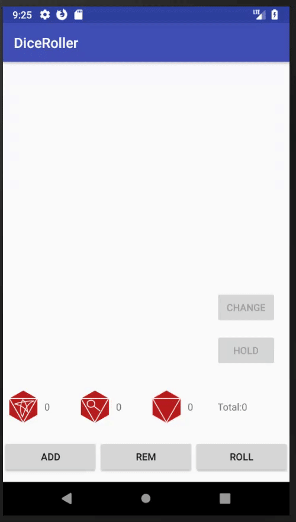
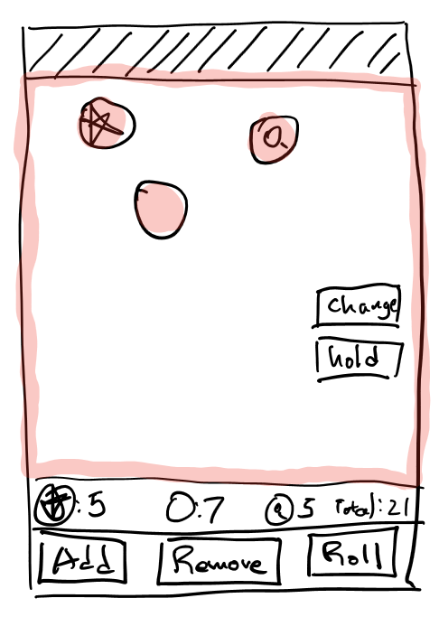
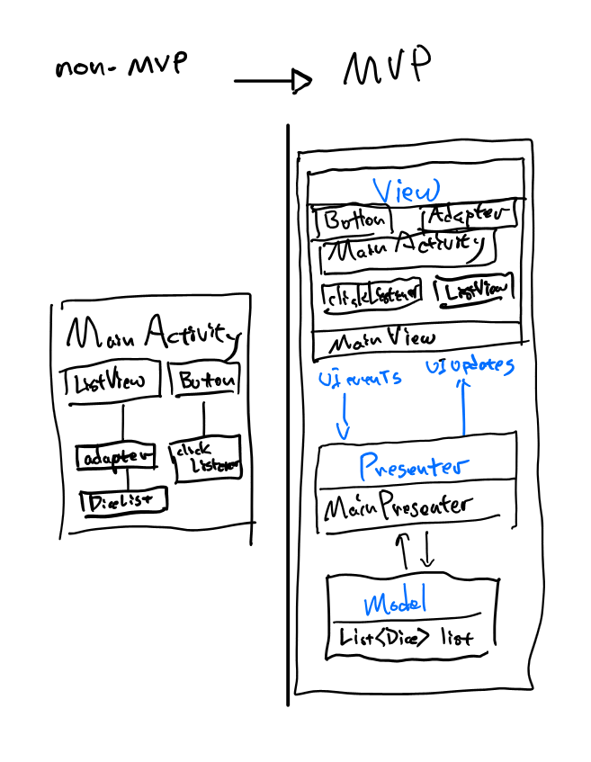
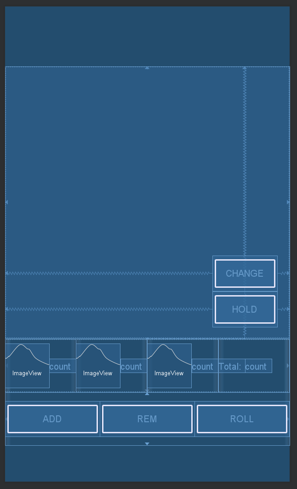

Android Tutorial - Dice Roller App for Mansions of Madness - Part 3 of 5
========================================================================
Building a gesture driven interface with draggable elements.

In this tutorial I'm building:
-----------------------------


Concepts Covered:
-----------------
* Mobile Architecture Basics: Model View Presenter
* Touch-Draggable Views

Reader Requirements
------------------------
* Beginner Level Java
* Android: Views and Layouts
* Android: Basic Layout XML design

Contents
--------
* Proposal
* Model View Presenter Architecture
* Draggable Dice X/Y based dice positions using ````RelativeLayout````
* Hold and Change
    * Selectable Dice
    * Change and Hold Buttons

Proposal
==========
Improving Graphical Interfaces
---------------
In part 2, I mentioned that scrolling through a dice list is not so user friendly. So to make the interface feel more natural, I will change the dice roll area from a ````ListView```` into a graphical Layout modeling a physical dice board where the player can place the dice anywhere on the board.

Design
=======


Implementation Steps
======================

1. Refactor into MVP
2. Swap in new DiceRollLayout
3. Draggable Dice
    * Custom ImageView : DiceView
    * Capturing Touch Event Handling    
4. Hold and Change buttons
    * Selectable/Unselect Dice
    * Hold Button
    * Change Button    

Step 1 : Model View Presenter
======================================================
## Architecture 101 ##
All I'm doing in this tutorial is replacing the area occupied by the  ````@+id/dice_list```` ````ListView```` element with a graphical dice board layout. Ideally, I wouldn't have to touch any code unrelated to rendering dice. But as it stands, I'd need to delete the ````DiceAdapter````, add/remove Layout components, and rewrite the ````MainActivity```` class.

Instead of jumping into the code and rewriting ````MainActivity````, I'm first going to reorganize my code and add some structure. This first task falls into the broad category of [Software Architecture](https://en.wikipedia.org/wiki/Software_architecture). A common approach to architecting mobile apps is [Model-View-Presenter](https://en.wikipedia.org/wiki/Model%E2%80%93view%E2%80%93presenter).
  1. Model
      * Encapsulates Domain specific non-UI Logic, Data Sources
      * In this case, the model layer object consists of the list of dice and logic around dice such as roll, add, and remove.
  2. View
      * Encapsulates UI, visual elements (Views, Layouts and Buttons) and user interactions(Activity)
      * For many apps, most of the code base falls into this category. Any Android specific UI components such Views, Layouts, and Activities fall into this category.
  3. Presenter
      * Coordinates UI changes and Model changes.
      * This is where the tire meets the road. The Presenter translates the UI events into model changes and translates model changes into UI events.


###### *Image By Google - http://www.gwtproject.org/articles/testing_methodologies_using_gwt.html, CC BY-SA 3.0, https://commons.wikimedia.org/w/index.php?curid=34271902* ######

## Refactoring into MVP ##



I create a ````MainView```` interface to encapsulate UI updates and implement it with ````MainActivity````. The intent for this is to avoid references to Android UI elements from the Presenter layer.

### ````MainView.java````
    public interface MainView {
      void updateDiceCount(int totalDice, int blankDice, int magDice, int starDice);
      void rollDice(int diceIndex);
      void refreshAdapter();
    }

The Presenter layer is responsible for coordinating UI changes with Model changes. In this case, the model is only a list of dice so I will not have a formal interface separating Presenter and Model layers.

### ````MainPresenter.java````

    public class MainPresenter {
      private static final int MAX_DICE_COUNT = 25;

      List<Dice> diceList = new ArrayList<>();
      private MainView mainView;

      private int countDice(Dice.Face type) {
          int count =0;
          for(Dice dice : diceList) {
              if(dice.diceVal == type) {
                  count++;
              }
          }
          return count;
      }

      public void setView(MainView mainView) {
          this.mainView = mainView;
      }

      public void addButtonClicked() {
          if(diceList.size()<MAX_DICE_COUNT) {
              diceList.add(new Dice());
              mainView.refreshAdapter();
              mainView.updateDiceCount(diceList.size(), countDice(Dice.Face.BLANK), countDice(Dice.Face.MAGNIFY), countDice(Dice.Face.STAR));
          }
      }

      public void removeButtonClicked() {
          if(!diceList.isEmpty()) {
              diceList.remove(diceList.size() - 1);
              mainView.refreshAdapter();
              mainView.updateDiceCount(diceList.size(), countDice(Dice.Face.BLANK), countDice(Dice.Face.MAGNIFY), countDice(Dice.Face.STAR));
          }
      }

      public void rollButtonClicked() {
          for(int index=0;index<diceList.size();index++) {
              Dice dice = diceList.get(index);
              if(!dice.hold) {
                  dice.roll();
                  mainView.rollDice(index);
              }
          }
          mainView.refreshAdapter();
      }

      public void changeButtonClicked(int diceIndex) {
          Dice dice = diceList.get(diceIndex);
          dice.nextValue();
          mainView.refreshAdapter();
          mainView.updateDiceCount(diceList.size(), countDice(Dice.Face.BLANK), countDice(Dice.Face.MAGNIFY), countDice(Dice.Face.STAR));
      }

      public void holdButtonClick(int diceIndex) {
          Dice dice = diceList.get(diceIndex);
          dice.toggleHold();
          mainView.refreshAdapter();
          mainView.updateDiceCount(diceList.size(), countDice(Dice.Face.BLANK), countDice(Dice.Face.MAGNIFY), countDice(Dice.Face.STAR));
      }

      public List<Dice> getDiceList() {
          return diceList;
      }
    }


### ````MainActivity.java````

    public class MainActivity extends AppCompatActivity implements MainView {

        ...
        MainPresenter presenter;
        ...
        @Override
        protected void onCreate(Bundle savedInstanceState) {
            ...

            //Presenter
            presenter = new MainPresenter();
            presenter.setView(this);

            ...
        }

        @Override
        public void rollDice(int diceIndex) {
            //roll all dice that are not being held
            View diceRowView = listView.getChildAt(diceIndex);

            if (diceRowView != null) {
                ImageView diceView = diceRowView.findViewById(R.id.dice_icon);
                int rotation = randomRotation();
                int duration = randomDuration();

                RotateAnimation rotate = new RotateAnimation(
                        0, rotation,
                        Animation.RELATIVE_TO_SELF, CENTER,
                        Animation.RELATIVE_TO_SELF, CENTER
                );
                rotate.setFillAfter(true);
                rotate.setFillEnabled(true);
                rotate.setDuration(duration);
                rotate.setInterpolator(new DecelerateInterpolator());

                diceView.startAnimation(rotate);
            }
        }

        @Override
        public void refreshAdapter() {
            this.diceAdapter.notifyDataSetChanged();
        }

        @Override
        public void updateDiceCount(int totalDice, int blankDice, int magDice, int starDice) {
            totalCount.setText(Integer.toString(totalDice));
            blankCount.setText(Integer.toString(blankDice));
            magCount.setText(Integer.toString(magDice));
            starCount.setText(Integer.toString(starDice));
        }

        public void onClickAddButton(View view) {
            presenter.addButtonClicked();
        }

        public void onClickRemoveButton(View view) {
            presenter.removeButtonClicked();
        }

        public void onClickRollButton(View view) {
            presenter.rollButtonClicked();
        }
    }

### Why bother with MVP? Is this work worth it?

An organized codebase is easier to maintain then a disorganized one. I would liken this to organizing one's living space. Functionally, there may be difference between organized code and disorganized code in terms of what the app does, much like a disorganized space is still livable. But when problems arise or when one wants to change something, fixing an organized codebase is much easier. So to answer the question, if you anticipate changes in the future, organizing code is a good idea.

### What if I don't like MVP?

There are multiple architecting paradigms available to follow including  [MVVM](https://en.wikipedia.org/wiki/Model%E2%80%93view%E2%80%93viewmodel) or [MVC](https://en.wikipedia.org/wiki/Model%E2%80%93view%E2%80%93controller). At the end of the day, these are tools that the industry has a whole have adopted to make engineering life easier. If you'd like to propose your own organization, that's perfectly reasonable!

Step 2 : Swap in DiceRollLayout
===========================
First, I'll swap in my new design. This includes replacing the listview with my custom layout and adding 2 buttons. One for change and one for hold dice.



    <?xml version="1.0" encoding="utf-8"?>
    <android.support.constraint.ConstraintLayout
        xmlns:android="http://schemas.android.com/apk/res/android"
        xmlns:app="http://schemas.android.com/apk/res-auto"
        xmlns:tools="http://schemas.android.com/tools"
        android:layout_width="match_parent"
        android:layout_height="match_parent"
        tools:context=".MainActivity">

        <farsight.solutions.tutorial.diceroller.DiceRollLayout
            android:id="@+id/dice_canvas"
            android:layout_height="0dp"
            android:layout_width="0dp"

            app:layout_constraintBottom_toTopOf="@id/dice_summary"
            app:layout_constraintLeft_toLeftOf="parent"
            app:layout_constraintRight_toRightOf="parent"
            app:layout_constraintTop_toTopOf="parent">
        </farsight.solutions.tutorial.diceroller.DiceRollLayout>

        <Button
            android:id="@+id/hold_button"
            android:layout_width="wrap_content"
            android:layout_height="wrap_content"
            android:text="Hold"
            android:onClick="onClickHoldButton"
            app:layout_constraintBottom_toBottomOf="@id/dice_canvas"
            app:layout_constraintHorizontal_bias="0.945"
            app:layout_constraintLeft_toLeftOf="parent"
            app:layout_constraintRight_toRightOf="parent"
            app:layout_constraintTop_toTopOf="parent"
            app:layout_constraintVertical_bias="0.949" />

        <Button
            android:id="@+id/change_button"
            android:layout_width="wrap_content"
            android:layout_height="wrap_content"
            android:text="Change"
            android:onClick="onClickChangeButton"
            app:layout_constraintBottom_toBottomOf="@id/dice_canvas"
            app:layout_constraintHorizontal_bias="0.945"
            app:layout_constraintLeft_toLeftOf="parent"
            app:layout_constraintRight_toRightOf="parent"
            app:layout_constraintTop_toTopOf="parent"
            app:layout_constraintVertical_bias="0.799" />

        <LinearLayout
            android:id="@+id/dice_summary"
            android:layout_width="match_parent"
            android:layout_height="@dimen/control_bar_line_height"
            android:orientation="horizontal"
            android:weightSum="4"
            app:layout_constraintBottom_toTopOf="@id/button_bar"
            app:layout_constraintLeft_toLeftOf="parent"
            app:layout_constraintRight_toRightOf="parent"
            app:layout_constraintTop_toBottomOf="@id/dice_canvas">
            <LinearLayout
                android:layout_height="match_parent"
                android:layout_width="0dp"
                android:layout_weight="1"
                android:orientation="horizontal">
                <ImageView
                    android:layout_width="wrap_content"
                    android:layout_height="wrap_content"
                    android:padding="@dimen/dice_padding"
                    android:layout_gravity = "center"
                    android:src="@drawable/star"/>
                <TextView
                    android:id="@+id/star_count"
                    android:layout_gravity="center"
                    android:layout_height="wrap_content"
                    android:layout_width="wrap_content"
                    android:text="count"
                    />
            </LinearLayout>

            <LinearLayout
                android:layout_height="match_parent"
                android:layout_width="0dp"
                android:layout_weight="1"
                android:orientation="horizontal">
                <ImageView
                    android:layout_width="wrap_content"
                    android:layout_height="wrap_content"
                    android:layout_gravity="center"
                    android:padding="@dimen/dice_padding"
                    android:src="@drawable/magnifying_glass"/>
                <TextView
                    android:id="@+id/mag_count"
                    android:layout_gravity="center"
                    android:layout_height="wrap_content"
                    android:layout_width="wrap_content"
                    android:text="count"
                    />
            </LinearLayout>

            <LinearLayout
                android:layout_height="match_parent"
                android:layout_width="0dp"
                android:layout_weight="1"
                android:orientation="horizontal">
                <ImageView
                    android:layout_width="wrap_content"
                    android:layout_height="wrap_content"
                    android:layout_gravity = "center"
                    android:padding="@dimen/dice_padding"
                    android:src="@drawable/blank_dice"/>
                <TextView
                    android:id="@+id/blank_count"
                    android:layout_gravity="center"
                    android:layout_height="wrap_content"
                    android:layout_width="wrap_content"
                    android:text="count"
                    />
            </LinearLayout>

            <LinearLayout
                android:layout_width="0dp"
                android:layout_weight="1"
                android:layout_height="match_parent"
                android:orientation="horizontal">
                <TextView
                    android:layout_width="wrap_content"
                    android:layout_height="wrap_content"
                    android:layout_gravity="center"
                    android:text="@string/total_label"
                    />
                <TextView
                    android:id="@+id/total_count"
                    android:layout_gravity="center"
                    android:layout_height="wrap_content"
                    android:layout_width="wrap_content"
                    android:text="count"/>
            </LinearLayout>
        </LinearLayout>

        <LinearLayout
            android:id="@+id/button_bar"
            android:layout_weight="1"
            android:layout_width="match_parent"
            android:layout_height="@dimen/control_bar_line_height"
            android:orientation="horizontal"
            android:weightSum="3"
            app:layout_constraintBottom_toBottomOf="parent"
            app:layout_constraintLeft_toLeftOf="parent"
            app:layout_constraintRight_toRightOf="parent"
            app:layout_constraintTop_toBottomOf="@id/dice_summary">
            <Button
                android:id="@+id/add_dice_button"
                android:layout_gravity = "center"
                android:layout_weight="1"
                android:layout_width="wrap_content"
                android:layout_height="wrap_content"
                android:text="@string/add_button_label"
                android:onClick="onClickAddButton"/>
            <Button
                android:id="@+id/rem_dice_button"
                android:layout_gravity = "center"
                android:layout_weight="1"
                android:layout_width="wrap_content"
                android:layout_height="wrap_content"
                android:text="@string/rem_button_label"
                android:onClick="onClickRemoveButton"/>
            <Button
                android:id="@+id/roll_dice_button"
                android:layout_weight="1"
                android:layout_gravity = "center"
                android:layout_width="wrap_content"
                android:layout_height="wrap_content"
                android:text="@string/roll_button_label"
                android:onClick="onClickRollButton"/>
        </LinearLayout>

    </android.support.constraint.ConstraintLayout>


Step 3 : Draggable Dice
==================

To capture gestures for the draggable dice, I attach an ````OnTouchListener```` to the custom DiceView.  ````OnTouchListener```` offers several callback methods to detect gestures. What I'll need for the draggable dice feature is touch down and touch move. A summary of the Gesture framework can be found [here](https://developer.android.com/training/gestures/detector.html).

Previously, I represented the dice with ````ImageView````. Now that the Dice will have some custom behavior, the I'm creating a new ````DiceView```` class.

### ````DiceView.java```` ###

    public class DiceView extends ImageView {

        public DiceView(Context context) {
            this(context, null);
        }

        public DiceView(Context context, @Nullable AttributeSet attrs) {
            this(context, attrs, 0);
        }

        public DiceView(Context context, @Nullable AttributeSet attrs, int defStyleAttr) {
            super(context, attrs, defStyleAttr);
        }

        public void refreshDiceFace(Dice.Face face, Boolean hold) {
              switch (face) {
                  case BLANK:
                      setImageResource(R.drawable.blank_dice);
                      break;
                  case MAGNIFY:
                      setImageResource(R.drawable.magnifying_glass);
                      break;
                  case STAR:
                      setImageResource(R.drawable.star);
                      break;
            }
        }
    }

### Why are there 3 constructors? ###

Android Views have a bunch of different constructors because Views can be instantiated a couple different ways. The main two are xml instantiation (when views are defined in the layout xml), and programmatic. The 3 arg and 4 arg constructor are relevant for views that take into account [themes and style](https://developer.android.com/guide/topics/ui/look-and-feel/themes).

The ````DiceView````'s encapsulating Layout determines the position in the Layout. The Layouts that support X/Y positions are ````RelativeLayout```` and ````AbsoluteLayout````. For this app, I will extend ````RelativeLayout````. This custom layout has 1 method ````updateDicePositions````. ````updateDicePositions```` essentially syncs the DiceView on the board with the Dice in my model. If there are extra DiceView on the board, remove them. If there the diceBoard has fewer dice than the dicelist, add. Aind finally, when I add Dice, I add a the onTouchListener. The logic for updating the dice position is to capture the dice position when the user starts the touch gesture. As the user moves his finger around the board, update the diceView position.

### ````DiceRollLayout.java```` ###

    public class DiceRollLayout extends RelativeLayout {
        final static String TAG = DiceRollLayout.class.getName();

        public DiceRollLayout(Context context) {
            super(context);
        }

        public DiceRollLayout(Context context, AttributeSet attrs) {
            super(context, attrs);
        }

        public DiceRollLayout(Context context, AttributeSet attrs, int defStyleAttr) {
            super(context, attrs, defStyleAttr);
        }

        public void updateDicePositions(List <Dice> diceList) {

            int diceCount = diceList.size();

            //remove dice
            while (diceCount < getChildCount()) {
                this.removeViewAt(getChildCount() - 1);
            }

            //add dice
            while (getChildCount() < diceCount) {
                final int index = getChildCount();

                //initial layout parameters
                DiceRollLayout.LayoutParams layoutParams = new DiceRollLayout.LayoutParams(
                        RelativeLayout.LayoutParams.WRAP_CONTENT,
                        RelativeLayout.LayoutParams.WRAP_CONTENT
                );

                int diceViewSize = getResources().getDimensionPixelSize(R.dimen.dice_size);
                layoutParams.setMarginStart((index%5) * diceViewSize );
                layoutParams.topMargin = ((index/5) * diceViewSize );

                //initialize DiceView
                DiceView diceView = new DiceView(getContext(), null, 0);

                diceView.setLayoutParams(layoutParams);
                diceView.setBorderColor(ContextCompat.getColor(getContext(), R.color.diceSelectionBorderColor));
                diceView.setBorderOverlay(true);
                diceView.setBorderWidth(0);

                //touch drag listener
                diceView.setOnTouchListener(new View.OnTouchListener() {
                    RelativeLayout.LayoutParams parms;
                    float dx=0,dy=0,x=0,y=0;

                    @Override
                    public boolean onTouch(View view, MotionEvent event) {
                        switch(event.getAction())
                        {
                            case MotionEvent.ACTION_DOWN :
                            {
                                parms = (RelativeLayout.LayoutParams) view.getLayoutParams();
                                dx = event.getRawX() - parms.leftMargin;
                                dy = event.getRawY() - parms.topMargin;
                            }
                            break;
                            case MotionEvent.ACTION_MOVE :
                            {
                                x = event.getRawX();
                                y = event.getRawY();
                                parms.leftMargin = (int) (x-dx);
                                parms.topMargin = (int) (y-dy);
                                view.setLayoutParams(parms);
                            }
                            break;
                            case MotionEvent.ACTION_UP :
                            {
                                ((MainActivity)getContext()).onReleaseDiceView(index);
                            }
                            break;
                        }
                        return true;
                    }
                });

                this.addView(diceView);
            }

            //refresh dice face
            for (int i = 0; i < getChildCount(); i++) {
                DiceView diceView = (DiceView) getChildAt(i);
                diceView.refreshDiceFace(diceList.get(i).diceVal, diceList.get(i).hold);
            }
        }
    }

### Why use ````RelativeLayout```` instead of ````AbsoluteLayout````? ###

First, ````AbsoluteLayout```` has been deprecated. To explain a bit about that, ````AbsoluteLayout```` offered a way to position things by pixel position. The problem is that Android devices cover a very large range of device dimensions and pixel density. Pixel positioning is not a very reliable way position views into a layout.

Step 4 : Hold and Change Dice
=========================================
After removing the Dice rows, the app loses those Hold and Change buttons. To address this, I'm going add a state variable to the presenter that keeps track of which dice has been selected. The hold or change buttons triggers on the selected dice. If there are no dice selected, the buttons should be greyed out. And finally, I'll need to add a visual cue to indicate which dice has been selected. To do this, i'm going to borrow an open source ````CircleImageView```` from  [hdodenhof@github](https://github.com/hdodenhof/CircleImageView). What this custom image view offers is a circle shaped imageview with borders. The visual cue i'm looking for is just a circle around the dice.

Visual cue for selected dice

### ````DiceView.java```` ###

    public class DiceView extends CircleImageView {
        ...

        public void highlight() {
            this.setBorderWidth(6);
        }

        public void unhighlight() {
            this.setBorderWidth(0);
        }      
    }

Adding touch events to trigger select/deselect dice

### ````DiceRollLayout.java````

    public class DiceRollLayout extends RelativeLayout {
        ...
        public void updateDicePositions(List <Dice> diceList) {
            ...
            while (getChildCount() < diceCount) {
                ...
                //touch drag listener
                diceView.setOnTouchListener(new View.OnTouchListener() {
                    RelativeLayout.LayoutParams parms;
                    float dx=0,dy=0,x=0,y=0;

                    @Override
                    public boolean onTouch(View view, MotionEvent event) {
                        switch(event.getAction())
                        {
                            ...
                            case MotionEvent.ACTION_UP :
                            {
                                ((MainActivity)getContext()).onReleaseDiceView(index);
                            }
                            break;
                        }
                        return true;
                    }
                });

                this.addView(diceView);
            }
            ...
        }

        @Override
        protected void onAttachedToWindow() {
            super.onAttachedToWindow();

            this.setOnTouchListener(new OnTouchListener() {
                @Override
                public boolean onTouch(View v, MotionEvent event) {
                    switch (event.getAction()) {
                        case MotionEvent.ACTION_UP: {
                            ((MainActivity)getContext()).onTouchUpLayout();
                        }
                        break;
                    }
                    return true;
                }
            });
        }
        ...        
    }
