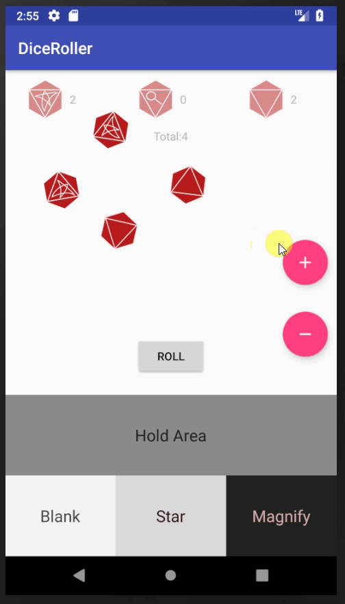
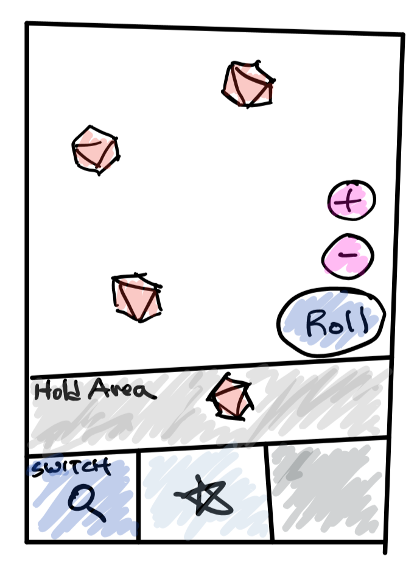

Android Tutorial - Dice Roller App for Mansions of Madness - Part 4 of 5
========================================================================
A world without buttons!

In this tutorial I'm building:
-----------------------------


Concepts Covered:
-----------------
* Position aware views

Reader Requirements
------------------------
* Beginner Level Java
* Android: Views and Layouts
* Android: Basic Layout XML design

Contents
--------

Proposal
==========
Buttons suck
---------------
Buttons are the dominant mechanism that apps use to trigger some behavior. Sure,
it works...but I find that buttons on mobile interfaces pretty annoying to use.
I believe that app should be as much as possible gesture driven.  In this
tutorial I trim away the hold and change buttons away from the interface.

Currently, the five buttons are add, remove, roll, change, and hold. Now that
the dice graphic is touch draggable, I propose using gestures to hold dice and
change dice. Specifically, i'm going to create zones in the interface that will
hold the dice and switch the dice to some value.

Design
======


Implementation Steps
====================

1. Butterknife refactor
2. Position Listener
3. State Change

Step 1 : View binding with Butterknife
======================================================
In the previous tutorial, I reorganized the code to have a bit of structure.

Step 2 : Refactoring the View Presenter relationship
===========================

In part 4, I introduced Presenter-View modules where all UI events call
the ````Presenter```` object and the presenter instructs UI behavior based. By
removing 2 buttons and introducing zones, the UI events change from

* click add Button
* click remove Button
* click roll Button
* ~~click change Button~~
* ~~click hold button~~
* ~~release dice~~
* ~~touch background layout~~

into

* click add Button
* click remove Button
* click roll Button
* **dice in hold/roll/switch zone**

On the ````View```` side we change from

* updateDiceCount
* spinDice
* ~~refreshDiceLayout~~
* ~~highlightDice~~
* ~~unhighlightAllDice~~
* ~~disableChangeButton~~
* ~~enableChangeButton~~
* ~~disableHoldButton~~
* ~~enableHoldButton~~

into

* updateDiceCount
* spinDice
* **redrawDice**

The removal of buttons simplified the interface between the two layers by about
a half.

To implement these changes, I modify my touch listener to inspect the position
of dice to see what zone it is in.

    ....
    @Override
    public boolean onTouch(View view, MotionEvent event) {

       switch(event.getAction())
       {
           case MotionEvent.ACTION_DOWN :
           {
               parms = (RelativeLayout.LayoutParams) view.getLayoutParams();
               dx = event.getRawX() - parms.leftMargin;
               dy = event.getRawY() - parms.topMargin;
           }
           break;
           case MotionEvent.ACTION_MOVE :
           {
               x = event.getRawX();
               y = event.getRawY();

               parms.leftMargin = boundifyX(x-dx);
               parms.topMargin = boundifyY(y-dy);

               if(inHoldZone(parms)) {
                   presenter.diceInZone(index, Zone.HOLD);

                   if(diceInLeftFlipZone(parms)) {
                       presenter.diceInZone(index, Zone.SWITCH_BLANK);
                   } else if(diceInRightFlipZone(parms)) {
                       presenter.diceInZone(index, Zone.SWITCH_MAGNIFY);
                   } else if(diceInCenterFlipZone(parms)) {
                       presenter.diceInZone(index, Zone.SWITCH_STAR);
                   }
               } else {
                   presenter.diceInZone(index, Zone.ROLL);
               }

               view.setLayoutParams(parms);
           }
           break;
       }
       return true;
    }
    ....


The presenter will set the new state for the dice and notify the View layer to redraw all dice.

    public void diceInZone(int index, Zone type) {
         Dice dice = diceList.get(index);

         switch(type) {
             case HOLD:
                 dice.setHold(true);
                 break;
             case ROLL:
                 dice.setHold(false);
                 break;
             case SWITCH_MAGNIFY:
                 dice.diceVal = Dice.Face.MAGNIFY;
                 break;
             case SWITCH_BLANK:
                 dice.diceVal = Dice.Face.BLANK;
                 break;
             case SWITCH_STAR:
                 dice.diceVal = Dice.Face.STAR;
                 break;
         }
         mainView.redrawDice(diceList);
         updateDiceCount();
     }

### What's ````boundify````? ###

The method ````boundifyX()```` is a convenient method I wrote that ensures that
when the user drags the dice around the screen, the dice remains in bounds.
