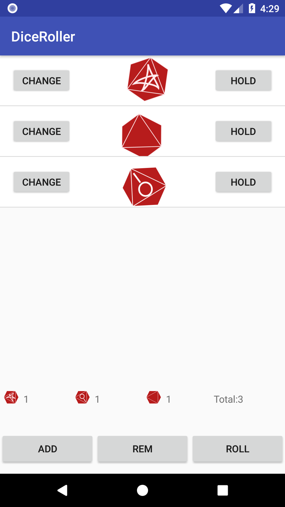

Android App - Mansions of Madness Dice - Part2
=======================================
In part 2 of this tutorial we put on our user design hats and try to improve the app.

New Requirements
=============
The initial design covered the basic mansions of madness dice roll function. But the problem is that the app isn't very user friendly:

* A user needs to scroll through the entire dice list to count dice. Manually counting dice is pretty cumbersome.
* If a player sets a dice to 'hold', the app doesn't show any visual cue. It's really easy to lose track of what's held and what's not held.
* When a player triggers a roll, the dice face just changes or remains the same. This can be especially confusing if say there was only 1 dice and the player rolls the same value as before.

To tackle the above issues, I've come up with a couple ideas.
* Expand the bottom area with a dice count widget.
* Tapping 'hold' changes the row background. The 'hold' text changes to 'unhold'.
* Tapping 'roll' triggers an animation. The animation will be a dice spin. Each dice will spin between 1 and 3 seconds and between 1 and 3 revolutions.

Design
=======


Implementation Steps
======================

1.  Refactoring into separate classes for better organization
2.  Adding a Dice summary
3.  Setting row background grey when Dice is in 'HELD' state
4.  Rotation dice on roll
5.  Populating Dice count into summary

Step 1 : Refactor
==================
Currently, all the app logic sits in one class ````MainActivity.java````. As we add more logic, things can get pretty messy and difficult to read. As a first step, I'm splitting out the inner classes into top level classes ````Dice```` and ````DiceAdapter````.

Migrating the ````Dice```` class from an inner class to a Top level class incurred no changes.

    Dice.java
    public class Dice {
        public enum Face {
            BLANK,
            MAGNIFY,
            STAR
        }

        public static Random random = new Random();

        boolean hold = false;
        Face diceVal;

        Dice() {
            roll();
        }

        public void roll() {
            int num = random.nextInt(4);
            if(num == 0) { //25% magify
                this.diceVal = Face.MAGNIFY;
            } else {
                //37.5% star, 37.5% blank
                if(random.nextBoolean()) {
                    this.diceVal = Face.BLANK;
                } else {
                    this.diceVal = Face.STAR;
                }
            }
        }

        public void toggleHold() {
            hold = !hold;
        }

        public void nextValue() {
            int index = diceVal.ordinal();
            index = (index+1) % Face.values().length;
            diceVal = Face.values()[index];
        }
    }


The DiceAdapter needed some refactoring as in the original version directly referenced the activity object.

    DiceAdapter.java
    public class DiceAdapter extends ArrayAdapter<Dice> {

        public DiceAdapter(@NonNull Context context, int resource, List<Dice> list) {
            super(context, resource, list);            
        }

        @Override
        public View getView(final int position, View convertView, ViewGroup parent) {
            if (convertView == null) {
                convertView = LayoutInflater.from(getContext()).inflate(R.layout.dice_row, parent, false);
            }

            //setup dice image
            ImageView imageView = convertView.findViewById(R.id.dice_icon);
            Dice dice = this.getItem(position);
            switch (dice.diceVal) {
                case BLANK:
                    imageView.setImageResource(R.drawable.blank_dice);
                    break;
                case MAGNIFY:
                    imageView.setImageResource(R.drawable.magnifying_glass);
                    break;
                case STAR:
                    imageView.setImageResource(R.drawable.star);
                    break;
            }

            //setup dice hold button
            Button holdButton = convertView.findViewById(R.id.dice_hold_button);
            holdButton.setOnClickListener(new View.OnClickListener() {
                @Override
                public void onClick(View v) {
                    Dice dice = getItem(position);
                    dice.toggleHold();
                    notifyDataSetChanged();
                }
            });

            //setup dice change button
            Button changeButton = convertView.findViewById(R.id.dice_change_button);
            changeButton.setOnClickListener(new View.OnClickListener() {
                @Override
                public void onClick(View v) {
                    Dice dice = getItem(position);
                    dice.nextValue();
                    notifyDataSetChanged();
                }
            });

            return convertView;
        }
    }

Step 2 : Dice summary Layout
=======================
The Dice summary layout consists of blank count/label, star count/label, magnifying glass count/label, total count.


    activity_main.xml
    ....
    <LinearLayout
        android:id="@+id/button_bar"
        android:layout_width="match_parent"
        android:orientation="vertical"
        android:layout_height="@dimen/control_bar_height"
        android:weightSum="2"
        app:layout_constraintBottom_toBottomOf="parent"
        app:layout_constraintLeft_toLeftOf="parent"
        app:layout_constraintRight_toRightOf="parent"
        app:layout_constraintTop_toBottomOf="@id/dice_list">

        <LinearLayout
            android:layout_weight="1"
            android:layout_width="match_parent"
            android:layout_height="@dimen/control_bar_line_height"
            android:orientation="horizontal"
            android:weightSum="4"
            android:baselineAligned="false">
            <LinearLayout
                android:layout_height="match_parent"
                android:layout_width="0dp"
                android:layout_weight="1"
                android:orientation="horizontal">
                <ImageView
                    android:layout_width="wrap_content"
                    android:layout_height="wrap_content"
                    android:padding="@dimen/dice_padding"
                    android:layout_gravity = "center"
                    android:src="@drawable/star"/>
                <TextView
                    android:id="@+id/star_count"
                    android:layout_weight="1"
                    android:layout_width="0dp"
                    android:layout_gravity="center"
                    android:layout_height="wrap_content"/>
             </LinearLayout>

            <LinearLayout
                android:layout_height="match_parent"
                android:layout_width="0dp"
                android:layout_weight="1"
                android:orientation="horizontal">
                <ImageView
                    android:layout_width="wrap_content"
                    android:layout_height="wrap_content"
                    android:layout_gravity="center"
                    android:padding="@dimen/dice_padding"
                    android:src="@drawable/magnifying_glass"/>
                <TextView
                    android:id="@+id/mag_count"
                    android:layout_weight="1"
                    android:layout_width="0dp"
                    android:layout_gravity="center"
                    android:layout_height="wrap_content"/>
            </LinearLayout>

            <LinearLayout
                android:layout_height="match_parent"
                android:layout_width="0dp"
                android:layout_weight="1"
                android:orientation="horizontal">
                <ImageView
                    android:layout_width="wrap_content"
                    android:layout_height="wrap_content"
                    android:layout_gravity = "center"
                    android:padding="@dimen/dice_padding"
                    android:src="@drawable/blank_dice"/>
                <TextView
                    android:id="@+id/blank_count"
                    android:layout_weight="1"
                    android:layout_width="0dp"
                    android:layout_gravity = "center"
                    android:layout_height="wrap_content"/>
            </LinearLayout>

            <LinearLayout
                android:layout_width="0dp"
                android:layout_weight="1"
                android:layout_height="match_parent"
                android:orientation="horizontal">
                <TextView
                    android:layout_width="wrap_content"
                    android:layout_height="wrap_content"
                    android:layout_gravity="center"
                    android:text="@string/total_label"/>
                <TextView
                    android:id="@+id/total_count"
                    android:layout_weight="1"
                    android:layout_width="0dp"
                    android:layout_gravity = "center"
                    android:layout_height="wrap_content"/>
            </LinearLayout>
        </LinearLayout>

        <LinearLayout
            android:layout_weight="1"
            android:layout_width="match_parent"
            android:layout_height="@dimen/control_bar_line_height"
            android:orientation="horizontal"
            android:weightSum="3">
            <Button
                android:id="@+id/add_dice_button"
                android:layout_gravity = "center"
                android:layout_weight="1"
                android:layout_width="wrap_content"
                android:layout_height="wrap_content"
                android:text="@string/add_button_label"
                android:onClick="addDice"/>
            <Button
                android:id="@+id/rem_dice_button"
                android:layout_gravity = "center"
                android:layout_weight="1"
                android:layout_width="wrap_content"
                android:layout_height="wrap_content"
                android:text="@string/rem_button_label"
                android:onClick="removeDice"/>
            <Button
                android:id="@+id/roll_dice_button"
                android:layout_weight="1"
                android:layout_gravity = "center"
                android:layout_width="wrap_content"
                android:layout_height="wrap_content"
                android:text="@string/roll_button_label"
                android:onClick="rollDice"/>
        </LinearLayout>
    </LinearLayout>
    ....




Step 3: Hold Button Triggers Background Change
==============================================

To implement this feature, we add a bit of logic in the DiceAdapter. If the ````Dice.hold```` is true, then background color should be light grey, otherwise we set it white. We also set the text to "HOLD" or "UNHOLD"

    DiceAdapter.java

    @Override
    public View getView(final int position, View convertView, ViewGroup parent) {

       ....
       //change background button text depending on hold state
       if(dice.hold) {
           convertView.setBackgroundColor(Color.LTGRAY);
           holdButton.setText(getContext().getResources().getString(R.string.hold_button_unhold_label));
       } else {
           convertView.setBackgroundColor(Color.WHITE);
           holdButton.setText(getContext().getResources().getString(R.string.hold_button_hold_label));
       }
       ....
    }

Step 4: Dice Rotation
=====================
The current 'Roll' button logic goes through all the dice and sets new values for each. To add dice animation, we'll need to get the corresponding Dice View and trigger some animation on it.

    MainActivity.java
    ....
    public void rollDice(View view) {
        //roll all dice that are not being held
        ListView listView = findViewById(R.id.dice_list);

        for(int i=0;i<diceList.size();i++) {
            Dice dice = diceList.get(i);

            if(!dice.hold) {
                dice.roll();
                View diceRowView = listView.getChildAt(i);
                if (diceRowView != null) {
                    ImageView diceView = diceRowView.findViewById(R.id.dice_icon);
                    int rotation = randomRotation();
                    int duration = randomDuration();

                    RotateAnimation rotate = new RotateAnimation(
                            0, rotation,
                            Animation.RELATIVE_TO_SELF, CENTER,
                            Animation.RELATIVE_TO_SELF, CENTER
                    );
                    rotate.setDuration(duration);
                    rotate.setFillAfter(true);
                    rotate.setFillEnabled(true);
                    rotate.setInterpolator(new DecelerateInterpolator());

                    diceView.startAnimation(rotate);
                }
            }
        }

        //notify adapter to update view
        diceAdapter.notifyDataSetChanged();
        updateDiceCount();
    }

    private int randomDuration() {
        return ONE_SECOND + random.nextInt(TWO_SECONDS);
    }

    private int randomRotation() {
        return FULL_REVOLUTION + random.nextInt(THREE_REVOLUTION);
    }
    ....

Step 5: Populating Dice Count into Widget
=========================================


    public void updateDiceCount() {
        TextView totalCount = findViewById(R.id.total_count);
        totalCount.setText(Integer.toString(diceList.size()));

        TextView blankCount = findViewById(R.id.blank_count);
        blankCount.setText(Integer.toString(countDice(BLANK)));

        TextView magCount = findViewById(R.id.mag_count);
        magCount.setText(Integer.toString(countDice(MAGNIFY)));

        TextView starCount = findViewById(R.id.star_count);
        starCount.setText(Integer.toString(countDice(STAR)));

    }

    private int countDice(Dice.Face type) {
        int count =0;
        for(Dice dice : diceList) {
           if(dice.diceVal == type) {
               count++;
           }
        }
        return count;
    }
